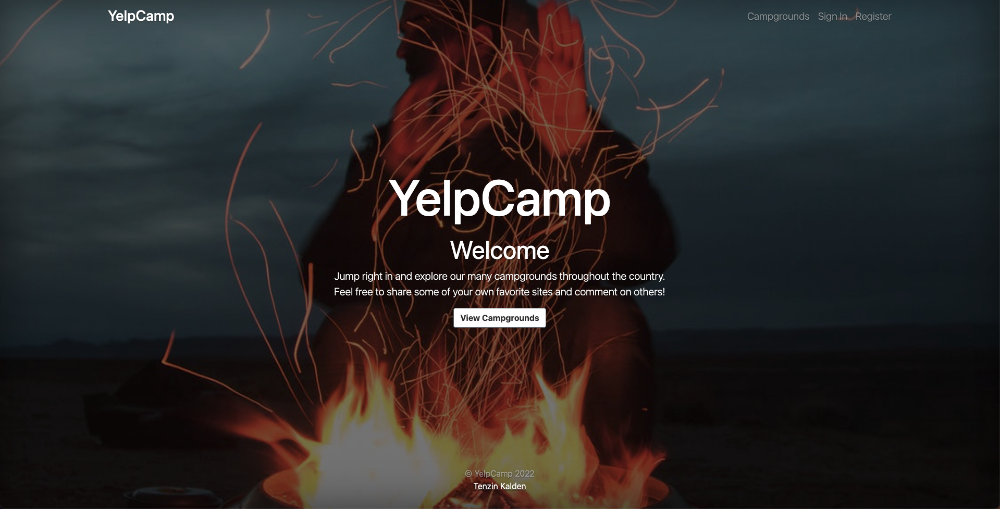
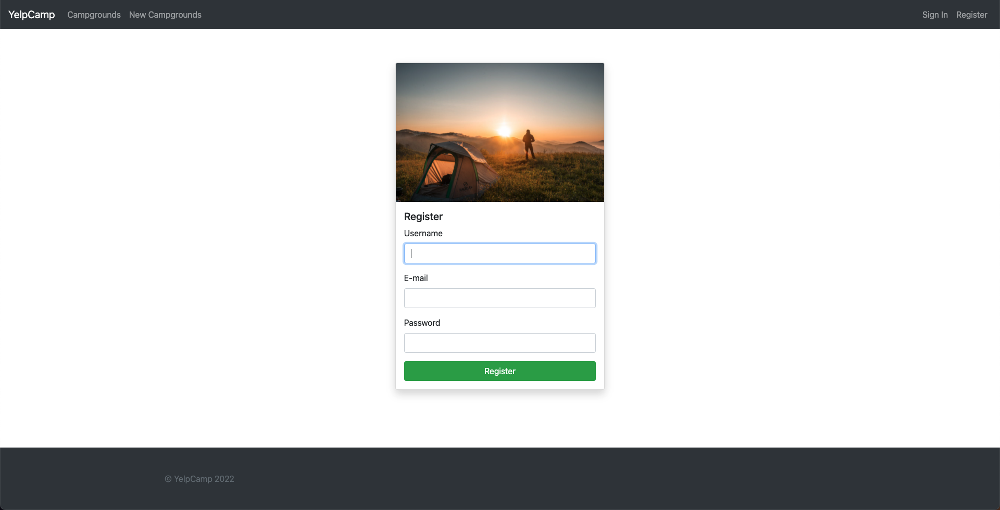
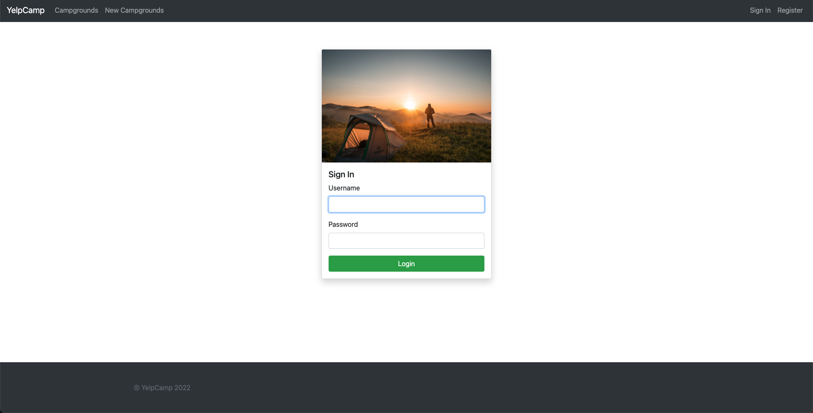
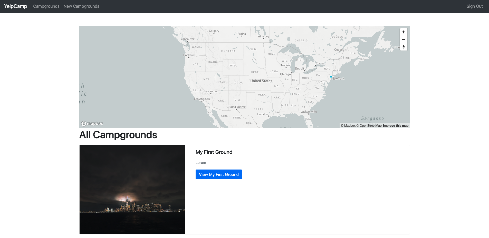
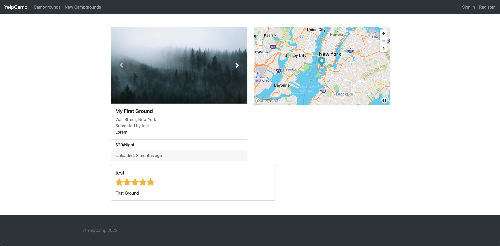
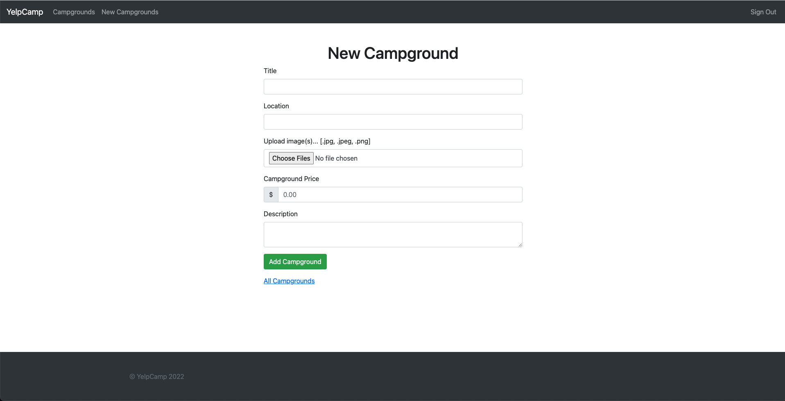

# YelpCamp

## Mock Yelp-clone project geared towards the avid camper! 

#### Using MongoDB to host user info and data, the user is able to sign up or login if they are already in the database.

#### Utilizing mock data to visualize data points on a cluster map. Users are able to create their own accounts, add campgrounds, comment and rate others campgrounds.

